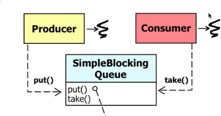

Coordinate interactions among threads in concurrent programs.

**Java volatile keyword**

volatile ensures that changes to variable are always consistent and visible to other threads atomically.
An atomic action is one that effectively happens all at once.
An atomic cannot stop in the middle.

Volatile is not needed in sequential programs:
-> Reads and writes of (most) java primitive variables are atomic.

Volatile is needed in concurrent programs.

# Built-in Monitor objects

Monitor objects are built into the Java programming language.
They support two types of synchronization.

**Mutual exclusion**
One thing gets into the critical section at a time.

**Coordination**

Things can move back and forth, by waiting and notifying.

=> Check java Docs to see synchronization classes.

